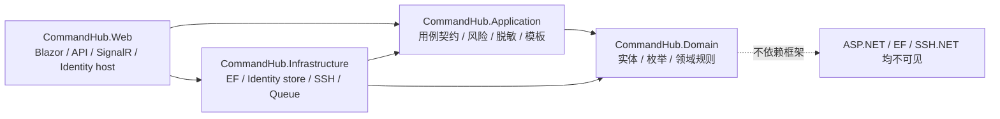
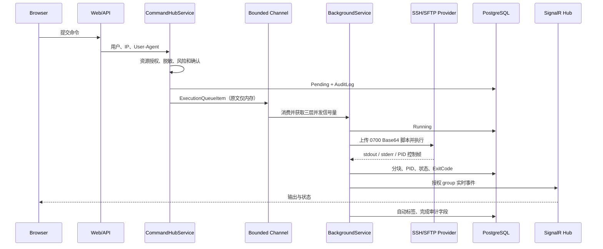
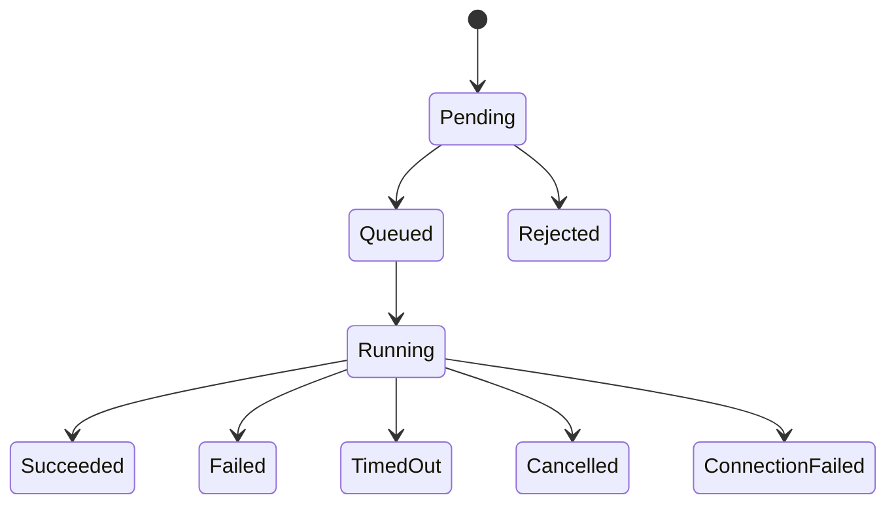

# 架构

## 分层与依赖

Domain 不引用 ASP.NET Core、EF Core、SignalR 或 SSH.NET。Application 定义 `ICommandExecutionProvider`、`IExecutionOutputSink`、队列和用例接口；Infrastructure 实现 SSH provider，因此未来可并列增加 Agent、Local 或 Kubernetes provider。

## 命令执行流程

## 状态机与取消

远程脚本输出经过严格解析的正整数 PID。取消使用独立 SSH 会话发送进程组 TERM，短暂宽限后发送 KILL。状态明确是 best effort，因为 SSH 断线时无法证明整个远程进程树已经结束。

## 数据模型

核心关系为 Server 1:1 ServerCredential、Server 1:N UserServerPermission、Server 1:N CommandExecution、CommandExecution 1:N CommandOutputChunk、CommandExecution N:M Tag、User N:M Execution（CommandFavorite）以及 CommandTemplate 1:N CommandTemplateParameter。审计表没有普通修改/删除用例。所有列表查询分页且只读查询使用 `AsNoTracking`。

## 安全边界

浏览器、API 输入、Shell 文本、SSH 服务器和反向代理头均不可信。Web 做身份边界，Application 做规则边界，Infrastructure 做凭据/Host Key/数据库/SSH 边界。UI 隐藏按钮仅改善体验；服务端每次执行、查看、取消、下载和加入 SignalR group 都重新授权。
